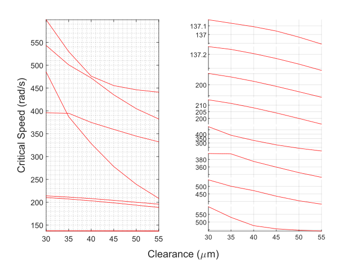

READ LICENSE.

# RotorWhirl
Whirl prediction in rotors with an aerostatic thrust bearing at one end.

Theory developed and validated by Riju Chatterjee and Ashutosh Patel. The general idea behind (an earlier version of) the whirl prediction method is here: [Conference Paper](https://doi.org/10.1115/GT2022-82632), [Video Presentation](https://youtu.be/lfDOsH-XRDQ)

Some of these .m files do whirl prediction. Others fit and plot curves to model aerostatic bearing behavior.

## Examples
### Whirl prediction in homogenous partially hollow stepped shaft
<p align="center">
  
</p>

From the code directory, run:

```
rotor_data = example_rotor()
bearing_data = example_bearing()
material_properties = default_material_properties()
simulation_settings = default_simulation_settings()
RunRotorWhirlSimulations(rotor_data,bearing_data,material_properties,simulation_settings)
plot_crits
```
Results:
<p align="center">
  
</p><p align="center">
   
</p><p align="center">
     
</p><p align="center">
  
</p>

[^1]: https://ecommons.udayton.edu/graduate_theses/767 
