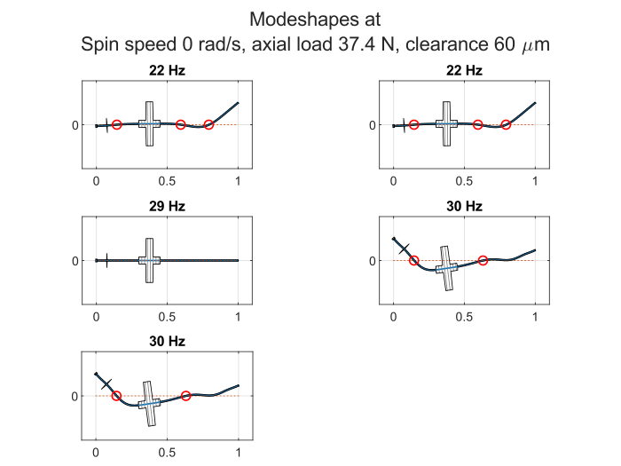

READ LICENSE.

# RotorWhirl
Whirl prediction in rotors with an aerostatic thrust bearing at one end.

Theory developed and validated by Riju Chatterjee and Ashutosh Patel. The general idea behind (an earlier version of) the whirl prediction method is here: [Conference Paper](https://doi.org/10.1115/GT2022-82632), [Video Presentation](https://youtu.be/lfDOsH-XRDQ)

Some of these .m files do whirl prediction. Others fit and plot curves to model aerostatic bearing behavior.

## Syntax
```
RunRotorWhirlSimulations(rotor_data,bearing_data,material_properties,simulation_settings)
plot_crits
```

## Examples
### 1. Default example: stepped partially hollow shaft

```
% Define structs rotor_data, bearing_data, material_properties and simulation_settings
rotor_data = example_rotor()
bearing_data = example_bearing()
material_properties = default_material_properties()
simulation_settings = default_simulation_settings()

% Pass structs to RunRotorWhirlSimulations()
RunRotorWhirlSimulations(rotor_data,bearing_data,material_properties,simulation_settings)

% Plot critical speed map from output data stored in critspeeds.txt
plot_crits
```
Results:
<p align="center">
  
</p>
<p align="center">
  
</p><p align="center">
   
</p><p align="center">
     
</p><p align="center">
  
</p>

### 2. Smoothly varying profile
```
% Load default example
rotor_data = example_rotor()
bearing_data = example_bearing()
material_properties = default_material_properties()
simulation_settings = default_simulation_settings()

% Set shaft_step_locations empty to indicate custom profile
rotor_data.shaft_step_locations = []
rotor_data.shaft_step_values = []

% Define shaft profile using vectorized anonymous functions
rotor_data.outer_radius = @(x) -0.05*x.^5 + 0.3*x.^4 - 0.25*x.^3 + 0.05*x + 0.025        % Outer profile of shaft, used for mass/inertia calculation
rotor_data.stiff_radius = @(x) -0.05*x.^5 + 0.3*x.^4 - 0.25*x.^3 + 0.05*x + 0.025        % Outer profile used for stiffness calculation
rotor_data.inner_radius = @(x) -0.1*x.^5 + 0.2*x.^4 + 0.05*x.^3 - 0.1*x.^2 + 0.015       % Inner (axial hole) profile of shaft

% Update rotor properties
rotor_data.axial_hole_ends = [0 1]
rotor_data.lateral_support_locations = [0.2 0.8]
rotor_data.lateral_support_stiffnesses = [5e6 5e6]

% Update simulation settings
simulation_settings.max_speed = 2500

% Run analysis
RunRotorWhirlSimulations(rotor_data,bearing_data,material_properties,simulation_settings)

% Plot critical speed map
plot_crits
```
Results:
<p align="center">
  
</p><p align="center">
   
</p><p align="center">
     
</p><p align="center">
  
</p>

## Rotor Properties
Expected fields in the rotor_data struct:

```length``` Total length of shaft in meters

```shaft_initial_radius``` Radius in meters of shaft at left end

```lateral_support_locations``` Array of locations (distances in meters along shaft from left end) of lateral supports

```lateral_support_stiffnesses``` Stiffnesses of lateral supports

```axial_load_location``` Location of application of axial load

```shaft_step_locations``` Locations of changes in radius of stepped shaft; set empty for smooth profile

```shaft_step_values``` Changes in radius of shaft going left to right; positive values for increase in radius and negative values for decrease

```axial_hole_radius``` Radius of axial hole in stepped shaft

```axial_hole_ends``` 2-element array containing start and end locations of axial hole

```lumped_mass_location``` Array of locations of lumped masses on shaft

```lumped_mass_value``` Array of lumped mass values in Kg

```outer_radius``` For custom shaft profiles: handle to outer radius profile as vectorized function of axial coordinate

```inner_radius``` For custom shaft profiles: handle to inner (axial hole) radius profile as vectorized function of axial coordinate

```stiff_radius``` For custom shaft profiles: handle to effective profile for stiffness calculation as vectorized function of axial coordinate

## Bearing Properties
Expected fields in the bearing_data struct

```C1``` First thrust bearing constant fit to data

```C2``` Second thrust bearing constant fit to data

```C3``` Third thrust bearing constant fit to data

```disc_radius``` Radius of thrust bearing disc in meters

```disc_thickness``` Thickness os thrust bearing disc in meters

```num_orifices``` Number of equally spaced orifices on pitch circle

```orifice_radial_location``` Pitch circle radius of thrust bearing in meters

```bearing_angle_offset``` Angular offset in radians about rotor axis of stationary disc of thrust bearing

## Material Properties
Expected fields in the material_properties struct

```density``` Material density in Kg/m^3

```youngs_modulus``` Modulus of elasticity in Pa

```shear_modulus``` Shear modulus in Pa

## Simulation Settings
Expected fields in the simulation_settings struct

```num_processor_cores``` Number of processor cores to use

```num_assumed_modes``` Number of assumed-mode shapes to use

```campbell_resolution``` Horizontal resolution of Campbell diagram

```modeshape_plot_rate``` Number of modeshapes to plot per Campbell diagram

```max_nodal_locations``` Maximum number of nodal locaions in plotted modeshapes

```max_num_modeshapes``` Maximum number of modeshapes per plot

```max_speed``` Horizontal limit in radians of Campbell diagram

```air_gap``` Array of air gap values in meters to run analysis at

[^1]: https://ecommons.udayton.edu/graduate_theses/767 
