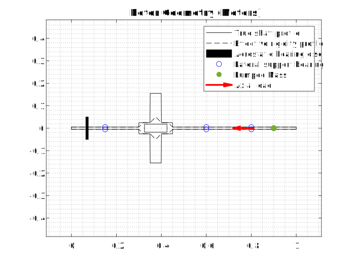

READ LICENSE.

# RotorWhirl
Whirl prediction in rotors with an aerostatic thrust bearing at one end.

Theory developed and validated by Riju Chatterjee and Ashutosh Patel. The general idea behind (an earlier version of) the whirl prediction method is here: [Conference Paper](https://doi.org/10.1115/GT2022-82632), [Video Presentation](https://youtu.be/lfDOsH-XRDQ)

Some of these .m files do whirl prediction. Others fit and plot curves to model aerostatic bearing behavior.

## Examples
### 1. Default example: stepped partially hollow shaft

```
% Define structs rotor_data, bearing_data, material_properties and simulation_settings
rotor_data = example_rotor()
bearing_data = example_bearing()
material_properties = default_material_properties()
simulation_settings = default_simulation_settings()

% Pass structs to RunRotorWhirlSimulations()
RunRotorWhirlSimulations(rotor_data,bearing_data,material_properties,simulation_settings)

% Plot critical speed map from output data stored in critspeeds.txt
plot_crits
```
Results:
<p align="center">
  
</p>
<p align="center">
  
</p><p align="center">
   
</p><p align="center">
     
</p><p align="center">
  
</p>

### 2. Smoothly varying profile
```
% Load default example
rotor_data = example_rotor()
bearing_data = example_bearing()
material_properties = default_material_properties()
simulation_settings = default_simulation_settings()

% Set shaft_step_locations empty to indicate custom profile
rotor_data.shaft_step_locations = []
rotor_data.shaft_step_values = []

% Define shaft profile using vectorized anonymous functions
rotor_data.outer_radius = @(x) -0.05*x.^5 + 0.3*x.^4 - 0.25*x.^3 + 0.05*x + 0.025        % Outer profile of shaft, used for mass/inertia calculation
rotor_data.stiff_radius = @(x) -0.05*x.^5 + 0.3*x.^4 - 0.25*x.^3 + 0.05*x + 0.025        % Outer profile used for stiffness calculation
rotor_data.inner_radius = @(x) -0.1*x.^5 + 0.2*x.^4 + 0.05*x.^3 - 0.1*x.^2 + 0.015       % Inner (axial hole) profile of shaft

% Update rotor properties
rotor_data.axial_hole_ends = [0 1]
rotor_data.lateral_support_locations = [0.2 0.8]
rotor_data.lateral_support_stiffnesses = [5e6 5e6]

% Update simulation settings
simulation_settings.max_speed = 2500

% Run analysis
RunRotorWhirlSimulations(rotor_data,bearing_data,material_properties,simulation_settings)

% Plot critical speed map
plot_crits
```

## Rotor Properties
Expected fields in the rotor_data struct:

```length```

```shaft_initial_radius```

```lateral_support_locations```

```lateral_support_stiffnesses```

```axial_load_location```

```shaft_step_locations```

```shaft_step_values```

```axial_hole_radius```

```axial_hole_ends```

```lumped_mass_location```

```lumped_mass_value```

```outer_radius```

```inner_radius```

```stiff_radius```

## Bearing Properties
Expected fields in the bearing_data struct

```C1```

```C2```

```C3```

```disc_radius```

```disc_thickness```

```num_orifices```

```orifice_radial_location```

```bearing_angle_offset```

## Material Properties
Expected fields in the material_properties struct

```density```

```youngs_modulus```

```shear_modulus```

## Simulation Settings
Expected fields in the simulation_settings struct

```num_processor_cores```

```num_assumed_modes```

```campbell_resolution```

```modeshape_plot_rate```

```max_nodal_locations```

```max_num_modeshapes```

```max_speed```

```air_gap```

[^1]: https://ecommons.udayton.edu/graduate_theses/767 
